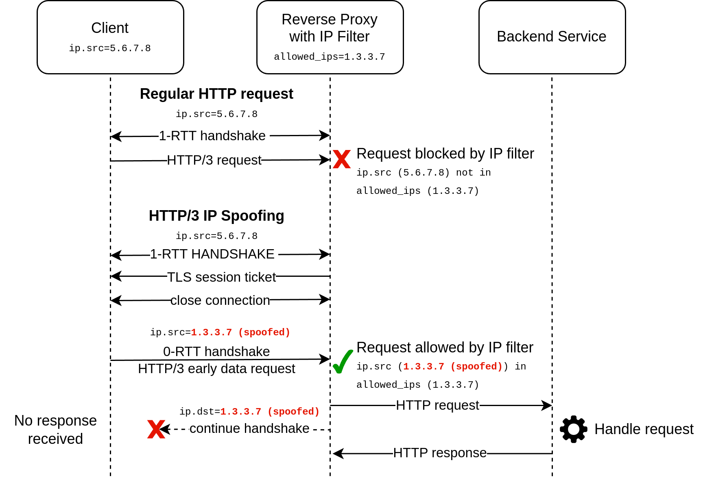

# HTTP/3 IP Spoofing via Early Data Requests in QUIC 0-RTT Handshake

Proof of concept for exploiting HTTP/3 IP spoofing via early data requests in 0-RTT handshake.
Send HTTP requests with a spoofed client IP address to a HTTP/3 QUIC server, tricking the server into processing the request before the client's IP address is validated.

```bash
docker compose run --rm ipspoofing https://target.com:443/ipfilter --spoofed-ip=1.3.3.7 -X POST -H '' -d "data=example"
```


## Technical Description
HTTP/3 supports sending HTTP requests as early data during QUIC 0-RTT handshakes to reduce RTT overhead for connection resumptions. Early data is sent and received before the handshake is completed and the client's IP address is validated. The initial packet containing the QUIC 0-RTT handshake information and the early data HTTP request are sent as a single UDP datagram. Due to UDP being used by QUIC, the source IP address can be spoofed. When HTTP/3 servers process early data requests, the application layer only sees the unvalidated - possibly spoofed - IP address.

First, attackers have to obtain a session ticket from the HTTP/3 server. For that, attackers have to establish an HTTP/3 connection to the server - using their real IP address - and wait for the server to send a session ticket. Note that attackers do not have to send an actual HTTP request over the established connection. After obtaining the session ticket, the attacker can close the connection. In the second step, attackers need to prepare a UDP datagram containing a QUIC initial packet with a TLS ClientHello and the session ticket,
a QUIC 0-RTT packet with early data encrypted with the pre-shared key from the session ticket, and an HTTP/3 request (open request stream, HEADERS frame, optionally DATA frame). This prepared UDP datagram can then be sent to the server with an arbitrarily spoofed source IP address in the IP packet header. When processing the HTTP request, the server trusts the spoofed IP address, which can be used to bypass IP-allow/block-lists.



A prerequisite for this attack to succeed is that HTTP/3 servers have implemented and enabled 0-RTT early data for HTTP/3 requests (and no mitigations are in place). A caveat is that attackers are not able to receive the server's response because the response is sent to the spoofed source IP address, making it a blind attack. Another limitation is that the request has to fit in a single UDP datagram, whose size is limited by the network path's MTU (minus some bytes for headers of encapsulating protocols such as HTTP/3, QUIC, UDP, IPv4/IPv6). Attackers need to be able to send UDP packets with a spoofed source IP address to the target server. Many ISPs block sending packets with spoofed IPs.

In HTTP/3 deployments, reverse proxies often terminate HTTP/3 and forward requests to internal services via HTTP/1.1 or HTTP/2, passing client IPs through headers like `X-Forwarded-For` or `Forwarded`. If unvalidated (or spoofed) IPs are forwarded by the reverse proxy, spoofed IPs can reach the application layer.


## Impact
* Bypassing IP Restrictions in Applications: e.g. `/admin/*` only allowed for 127.0.0.0/8
* Bypassing IP Allow-Lists on Reverse Proxies
* Abuse IP-based rate limits to block legitimate IPs: Attackers could send a large number of requests to trigger rate limits, whereas the spoofed IP addresses are the IPs of legitimate users.
* Forging IPs in logs


## Mitigations
* Enable QUIC address validation
* Enable QUIC address validation for 0-RTT handshakes via `NEW_TOKEN` frames
* Disable 0-RTT handshakes
* Disable early data in 0-RTT
* Delay processing HTTP/3 requests until the handshake is completed
* HTTP status code 425 Too Early


## Security Advisories
* Traefik: [CVE-2024-39321](https://www.cve.org/CVERecord?id=CVE-2024-39321), [GHSA-gxrv-wf35-62w9](https://github.com/traefik/traefik/security/advisories/GHSA-gxrv-wf35-62w9)
* H2O: [CVE-2024-45397](https://www.cve.org/CVERecord?id=CVE-2024-45397), [GHSA-jf2c-xjcp-wg4c](https://github.com/h2o/h2o/security/advisories/GHSA-jf2c-xjcp-wg4c)
* HAProxy: [CVE-2024-49214](https://www.cve.org/CVERecord?id=CVE-2024-49214)
* Caddy: [bugfix](https://github.com/caddyserver/caddy/pull/6427)

